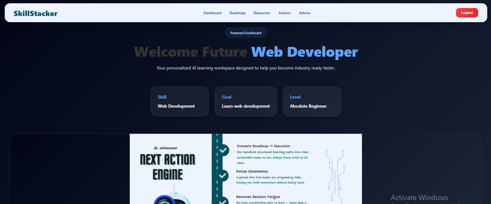
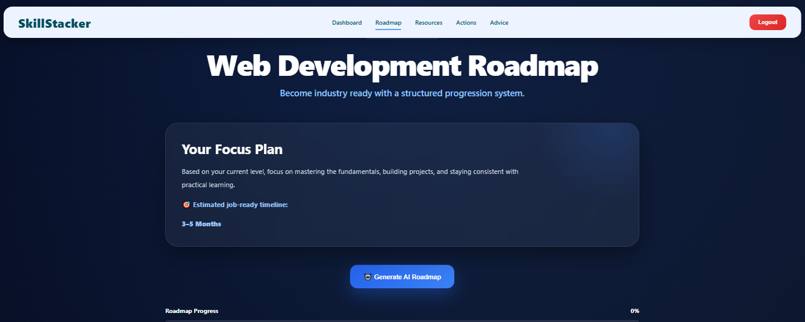
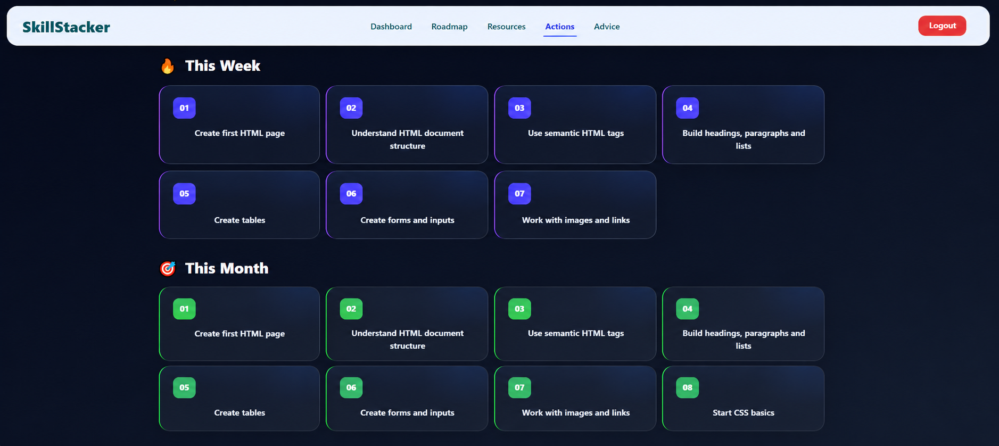
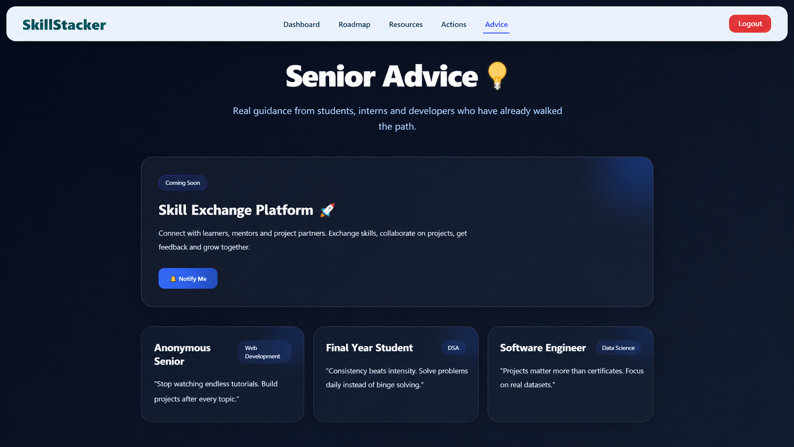
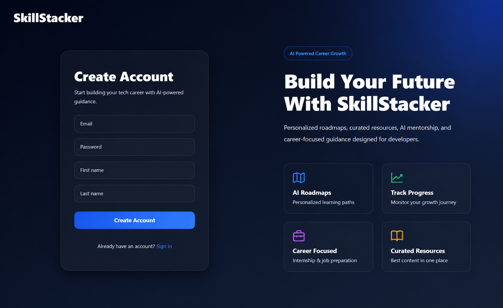

# SkillStacker

An AI-powered student roadmap platform that helps learners choose a career path, generate structured learning roadmaps, track progress, and receive actionable next steps.

---

## 📌 Features

### 🎯 Personalized Onboarding
- Collects student goals and interests
- Generates customized learning paths
- Reality check system for achievable goals

### 🗺️ Roadmap Generator
- Structured phase-wise learning roadmap
- Progress tracking
- Phase completion system
- AI-generated roadmap support

### ⚡ Next Actions Engine
- Daily actionable tasks
- Weekly goals
- Monthly targets
- Progress-based recommendations

### 💡 Senior Advice
- Community guidance section
- Advice sharing interface
- Skill Exchange Platform (Coming Soon)

### 🤖 AI Integration
- Personalized roadmap generation
- Dynamic learning suggestions
- Student-focused recommendations

---

## 🛠️ Tech Stack

### Frontend
- React.js
- React Router
- CSS3
- Swiper.js

### Backend
- Node.js
- Express.js

### Database
- MongoDB

### AI
- Groq API

---

## 📷 Screenshots

### Home Page



---

### Roadmap Generator



---

### Next Actions



---

### Senior Advice



---

### Signup



---

## 📂 Project Structure

```text
SkillStacker
│
├── CLIENT
│   ├── src
│   ├── public
│   └── package.json
│
├── SERVER
│   ├── src
│   ├── routes
│   ├── models
│   └── package.json
│
└── README.md
```

## ⚙️ Installation

### Clone Repository

```bash
git clone https://github.com/akstg007/SkillStacker.git
```

### Frontend

```bash
cd CLIENT
npm install
npm run dev
```

### Backend

```bash
cd SERVER
npm install
npm run dev
```

---

## 🌟 Upcoming Features

- Skill Exchange Platform
- User Authentication Improvements
- Community Posts
- Roadmap Sharing
- Resume Builder
- Interview Preparation Module
- Gamified Progress Tracking

---

## 👨‍💻 Developed By Akshat

Built as a student-focused learning platform to help learners become industry-ready through structured execution plans.
